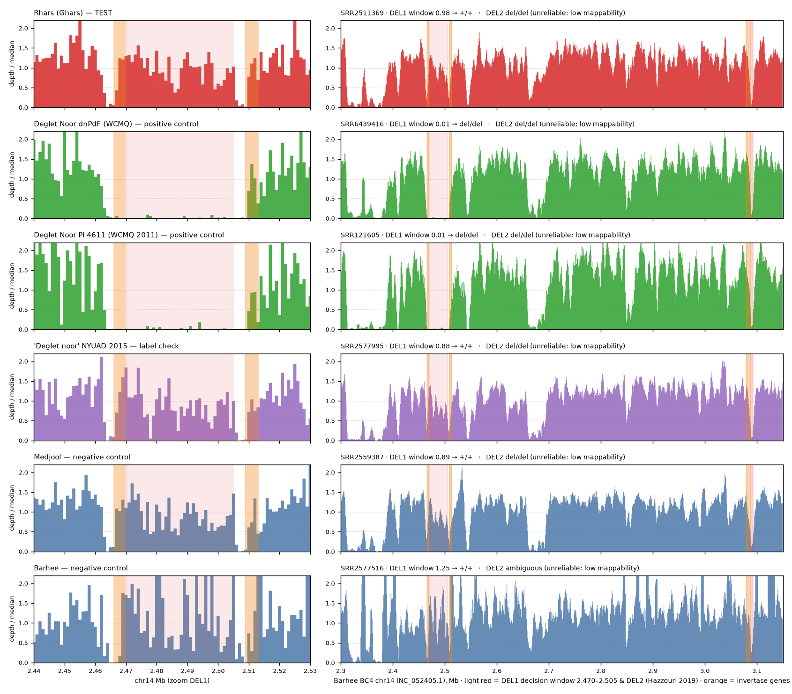

# 02 — هل يحمل جينوم الغرس حذف جينات الـ invertase (موضع السكروز)؟

> هذا أول تحليل منشور نعرفه لجينوم الغرس **بعينه**. القراءات عامة منذ 2015 (`SRR2511369`)، ولم
> نجد من قرأها عند هذا الموضع.

## 1. لماذا هذا السؤال

- **التمور صنفان حسب سكّرها.** الأوّل «سكروزي»، مثل الدقلة نور وسكّري. والثاني «سكّر محوَّل»
  (غلوكوز + فركتوز)، وهو أغلب الأصناف.
- **الفرق جيني ومعروف الموضع.** على الكروموسوم 14 حذف بطول ~40 kb يقتطع النصف الأمامي من جين
  invertase جداري (CWINV1) مع محفّزه. الأصناف السكروزية متماثلة لهذا الحذف أكثر من غيرها
  (`hazzouri2019`، Wilcoxon P < 9.3×10⁻⁷). ووُجد الحذف نفسه متماثلًا في الدقلة نور (`malek2020`).
- **النتيجة المتوقّعة: الغرس بلا حذف متماثل.** الغرس صنف طري، والمتاح من قياساته يشير إلى سكّر
  محوَّل. لكن قياس سكروز الثمرة الطازجة غير نظيف فيما وجدناه (`01-landscape.md` §4.2).
- **الجينوم دليل مستقلّ عن الكيمياء.** يُقرأ مرة واحدة من بيانات مجانية، ولا يتأثّر بالتصنيع أو
  بالموسم.

## 2. التصميم (مكتوب قبل النظر في النتائج)

| | |
|---|---|
| المرجع | Barhee BC4 `GCF_009389715.1` (تجميع `hazzouri2019` نفسه). الكروموسوم 14 = `NC_052405.1` |
| الحذف 1 (DEL1) | ~2.467–2.507 Mb حسب `hazzouri2019`. نافذة القرار **2.470–2.505 Mb** |
| تأكيد الإحداثيات | صففنا كونتيغ الدقلة نور `MT009343` (`malek2020`) على المرجع: لا يغطّي **2,464,557–2,508,694**، أي 44 kb تشمل CWINV1 (2,466,060–2,469,686). كونتيغ Khalas `MT009344` يغطّي المنطقة. النافذة داخل الفجوة |
| الحذف 2 (DEL2) | ~5 kb عند 3.088–3.093 Mb، في محفّز A/N-INV1 (`hazzouri2019`). نافذة صغيرة، فالحكم عليها أضعف |
| العيّنات | كلّها من نفس دفعة التسلسل (`PRJNA296800`، HiSeq 2500، 2015): **Rhars = الغرس** (اختبار)؛ **Deglet Noor** (ضابط موجب: حذف متماثل منشور)؛ **Medjool** و**Barhee** (ضابطان سالبان: سكّر محوَّل، `terada2026`، `malek2020`) |
| القراءات | أوّل 20 مليون قراءة لكل طرف (~5× خام)؛ Barhee كلّها (12.4 مليون زوج) |
| الربط | minimap2 2.28 `-x sr` على الجينوم **كاملًا** (حتى لا تنجذب قراءات من نسخ أخرى إلى الموضع)، ثم MAPQ ≥ 20، ثم المحاذاة الأولية فقط |
| التطبيع | وسيط عمق نوافذ 1 kb على الكروموسوم 14 خارج 2.0–3.3 Mb |
| **قاعدة القرار** | متوسّط العمق المطبَّع في النافذة: **< 0.15 حذف متماثل** (del/del)؛ **0.30–0.70 متغاير** (del/+)؛ **> 0.80 بلا حذف** (+/+)؛ وما بينها «غامض» |
| شرط صلاحية التشغيل | الضابط الموجب (Deglet Noor) يجب أن يخرج del/del في DEL1، والضابطان السالبان يجب ألّا يخرجا del/del. إن فشل أحدها، **لا يُقرأ الغرس** |
| **إضافة بعد التشغيل الأول (post hoc، مُعلنة)** | فشل الضابط الموجب المسجّل (§3.1)، فأضفنا ضابطين موجبين **مستقلّين** للدقلة نور من مختبر آخر: `SRR6439416` (dnPdF، Weill Cornell Qatar، `PRJNA427409`، أوّل 12 مليون قراءة لكل طرف) و`SRR121605` (Deglet Noor أنثى PI 4611، WCMQ 2011، `PRJNA40349`، 84 قاعدة أحادي الطرف، الملف كاملًا). **النوافذ وقاعدة القرار لم تتغيّر.** الشرط الجديد: الضابطان الموجبان كلاهما del/del، والسالبان ليسا del/del. عيّنة NYUAD «Deglet noor» صارت «فحص اسم» (`label_check`) لا ضابطًا |

السكريبتات: [`scripts/02_map.sh`](../scripts/02_map.sh)، ثم
[`scripts/02_invertase_cnv.py`](../scripts/02_invertase_cnv.py)، ثم
[`scripts/02b_plot_invertase.py`](../scripts/02b_plot_invertase.py).

**تحذير منهجي اكتشفناه أثناء التشغيل:** CWINV1 وCWINV3 نسختان مكرّرتان (تطابق 98.6% في الأحماض
الأمينية، `hazzouri2019`). لذلك تحصل قراءات جسمَي الجينين على MAPQ منخفض وتُحذف بالمرشّح، فيظهر
عمقهما منخفضًا حتى في صنف سليم (Barhee: 0.06 على جسم CWINV1). **القرار يُبنى على نافذة DEL1
بين الجينين فقط**، لا على أجسام الجينات.

## 3. النتيجة (2026-10-07)

**الخلاصة: الغرس بلا حذف (+/+)، ولا نسخة واحدة من أليل الحذف.** التشغيل صالح بضابطين موجبين
مستقلّين. لكن الطريق إلى هذا الحكم مرّ بفشل الضابط الأول، وهو مكتوب هنا كما وقع.

### 3.1 التشغيل الأول: فشل الضابط الموجب المسجّل مسبقًا

عيّنة NYUAD «Deglet noor» (`SRR2577995`، BioSample `SAMN04108868`) لم يظهر فيها الحذف. عمق نافذة
DEL1 فيها 0.88، مثل الضابطين السالبين، وملفّها بدقّة 1 kb مغطّى على طول 2.470–2.505 Mb. حسب القاعدة
المكتوبة مسبقًا **لم نقرأ الغرس**، وبحثنا عن ضوابط موجبة أخرى.

### 3.2 ضابطان موجبان مستقلّان (مضافان بعد الفشل)

- **`SRR6439416`، dnPdF:** من Weill Cornell Qatar، أي مختبر `malek2020` نفسه. اسم «dnPdF» يظهر
  في خريطة التغطية في شكلهم 1c. أخذنا أوّل 12 مليون قراءة لكل طرف.
- **`SRR121605`، Deglet Noor PI 4611:** من WCMQ 2011. قراءات 84 قاعدة أحادية الطرف، استُعمل
  الملف كاملًا.

اخترناهما قبل إعادة التشغيل، دون تغيير أي نافذة أو عتبة.

### 3.3 الجدول النهائي

المصدر: [`data/02_invertase_genotypes.tsv`](../data/02_invertase_genotypes.tsv)، من
`scripts/02_invertase_cnv.py`. المجال في العمود الرابع تقريبي: متوسّط ± 1.96 × الخطأ المعياري على
35 نافذة بطول 1 kb. النوافذ ليست مستقلّة تمامًا، وهذا المجال أُضيف بعد التشغيل الأول.

| العيّنة | الدور | الوسيط (×) | DEL1 (المجال 95%) | الحكم | DEL1 بأي MAPQ |
|---|---|---|---|---|---|
| `SRR2511369` Rhars = **الغرس** | اختبار | 2.73 | **0.98** (0.88–1.09) | **+/+** | 0.91 |
| `SRR6439416` Deglet Noor dnPdF | موجب | 2.39 | **0.01** (0.00–0.02) | del/del | 0.03 |
| `SRR121605` Deglet Noor PI 4611 | موجب | 1.63 | **0.02** (0.00–0.03) | del/del | 0.09 |
| `SRR2577995` NYUAD «Deglet noor» | فحص اسم | 2.81 | 0.88 (0.75–1.02) | +/+ | 0.95 |
| `SRR2559387` Medjool | سالب | 3.07 | 0.89 (0.78–1.00) | +/+ | 0.90 |
| `SRR2577516` Barhee | سالب | 0.67 | 1.25 (0.95–1.55) | +/+ | 1.23 |

**الصلاحية: PASS.** الموجبان del/del، والسالبان +/+.

*[`data/02_invertase_depth.png`](../data/02_invertase_depth.png):* العمود الأيسر تكبير لـ DEL1
(نوافذ 1 kb خام)، والأيمن 2.30–3.15 Mb. الأحمر الفاتح نافذة القرار، والبرتقالي جينات invertase.

**ماذا يُرى في الشكل:**
- **حدود الحذف.** في الضابطين الموجبين العمق صفر من ~2.463 إلى ~2.509 Mb. هذه هي نفسها الـ 44 kb
  الغائبة عن كونتيغ الدقلة نور `MT009343` (2,464,557–2,508,694، §2). طريقتان مستقلّتان (تجميع،
  وعمق قراءات) تعطيان نفس الحدود.
- **الغرس مغطّى على طول المنطقة.** الانخفاضان عند 2.463–2.467 و2.506–2.509 Mb يظهران في كل
  العيّنات، ومنها السالبة. سببهما المقاطع المكرّرة وجسما الجينين تحت مرشّح MAPQ (§2، التحذير
  المنهجي)، لا الحذف.

### 3.4 ماذا تعني النتيجة

- **الحكم:** الغرس متماثل للأليل المرجعي عند DEL1. المجال 0.88–1.09 يستبعد المتغاير (~0.5)،
  ويستبعد الحذف المتماثل (~0).
- **التنبّؤ:** الغرس لا يحمل السبب الجيني الرئيسي المعروف لتراكم السكروز في الدقلة نور، فالمتوقّع
  ثمرة سكّر محوَّل.
  - هذا يوافق `mimouni2014` (دبس غني بالفركتوز) و`mimouni2026` (لا سكروز في الدبس المُصنَّع).
  - ويخالف رقم `derkaoui2021` (~19% سكروز في بقايا الدبس، ومنهجيته `UNVERIFIED`).
- **حدّ التنبّؤ:** الارتباط «ليس تامًّا؛ بعض الأصناف السكروزية لا تحمل الحذف» (`hazzouri2019`).
  الجينوم لا يُثبت غياب السكروز. هو يقول فقط إن الغرس خالٍ من سببه الرئيسي المعروف.
- **هل هو جديد؟** حسب ما وجدناه، هذا أول تنميط منشور للغرس عند هذا الموضع. لكنه **تأكيد لا
  اختراق**: +/+ هي الحالة الغالبة في الغرب. في `malek2020`، الجدول 2، 49 من 67 عيّنة غربية (73%)
  متماثلة للأليل المرجعي.
- **نتيجة جانبية تستحقّ التسجيل:** عيّنة NYUAD «Deglet noor» العامة لا تحمل الحذف. في المقابل
  الدقلتان الأخريان هنا متماثلتان للحذف، وكذلك دقلة `malek2020`. فإمّا أن العيّنة موسومة خطأ أو
  من صنف آخر، وإمّا أنه تباين داخل الصنف، والبيانات لا تفرّق بينهما. **من يستعمل `SRR2577995`
  مرجعًا للدقلة نور يجب أن يحذر.**
- **DEL2 بلا حكم.** في كل العيّنات، والسالبة منها، يعود العمق عند MAPQ 0 (0.23–0.88). فالانخفاض
  سببه صعوبة الربط في منطقة متكرّرة، لا الحذف.

### 3.5 حدود هذه النتيجة

1. **هوية عيّنة Rhars قائمة على وسمها فقط، وفي نفس الدفعة عيّنة وسمها مشكوك فيه** (§3.4). هذا
   أكبر تحفّظ. التأكيد يحتاج تسلسل غرس موثّق المصدر، أو PCR لنقطتي الانقطاع على نخلة غرس معروفة.
2. الضابطان الموجبان أُضيفا بعد النظر في التشغيل الأول. أُعلن ذلك، ولم تتغيّر النوافذ ولا العتبات.
3. العيّنات مأخوذ منها جزء فقط (~5× خام؛ Barhee كلّها لكنها صغيرة). العمق بعد المرشّح على
   الكروموسوم 14 بين 0.67× (Barhee) و3.07×. هذا يكفي للتفريق بين 0 و0.5 و1 على نافذة 35 kb
   (المجالات في §3.3).
4. نقطتا الانقطاع الدقيقتان غير محدّدتين. طرفا الحذف في مقاطع مكرّرة (~1.6 kb) متطابقة بين CWINV1
   وCWINV3، وهذا متّسق مع إعادة تركيب غير أليلية (NAHR). عدّ القراءات المقصوصة عند الوصلة لم يعطِ
   إشارة فوق الخلفية، فلا نعتمده.
5. سكروز ثمرة الغرس الطازجة لم يُقَس قياسًا نظيفًا في ما وجدناه (`01-landscape.md` §4.2). الربط بين
   النمط الجيني والكيمياء ما زال تنبّؤًا.

### 3.6 الخطوة التالية (بوّابة القرار 1 ← الفرع الأول)

**قياس سكروز ثمرة غرس طازجة بـ HPLC-RI، دون تحليل حمضي.** يُقاس في نفس التشغيل دقلة نور للمقارنة.
**التنبّؤ المكتوب قبل القياس:** سكروز الغرس منخفض بوضوح مقارنة بالدقلة نور، والسكّر الغالب
غلوكوز وفركتوز. إن طابق القياس، صار عندنا أول ربط منشور بين نمط الغرس الجيني وكيمياء ثمرته. وإن
خالفه، فالغرس مثال على الارتباط غير التام الذي ذكره `hazzouri2019`، وهذا مثير بدوره.
